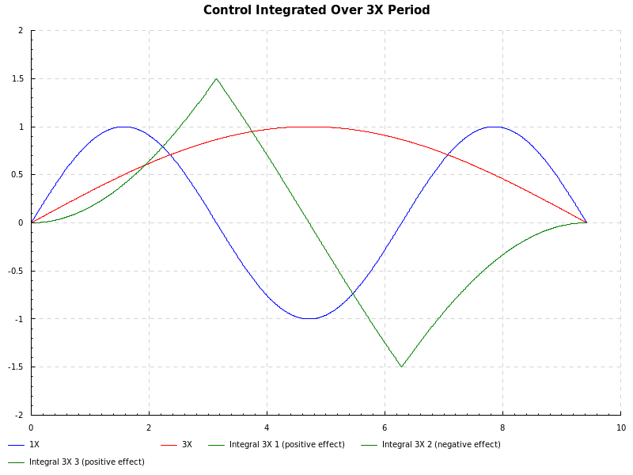

# HeavyLift

A large drone project for material transport.
Specifically, transporting snowboarders to the tops of mountains so they can ride down them.
(They are towed up, not flown.)

The idea is based on a [Monocopter](https://en.wikipedia.org/wiki/Monocopter) design for lift efficiency and easy transport.

- Clips onto a snowboard rack.
- Inspired by the [Charles McCutchen flying machine](http://www.airplanesandrockets.com/airplanes/charybdis-oct-1972-aam.htm) (the Charybdis).
    - [video](https://www.youtube.com/watch?v=IrK8k_OjIeA)
    - [video](https://www.youtube.com/watch?v=1oSck_XD0_M)
-  Monocopter videos:
    - [video](https://www.youtube.com/watch?v=u23Hqq8QbeE)
    - [video](https://www.youtube.com/watch?v=B4JKhi3khps)
    - [video](https://www.youtube.com/watch?v=Toa75LYNVxY)
    - [video](https://www.youtube.com/watch?v=I_6EjX8T9Ag)
- Yes, single blade helicopters [fly](https://www.youtube.com/watch?v=MH9N9comEy4) just [fine](https://www.youtube.com/watch?v=AD9juUWL5iU).

## Configuration

- Powerhead (gas or electric) as counter weight.
    - If gas, fuel tank at center of rotation to keep balance and fuel burns off.
- At center cargo hook on swivel drops rope to poma seat or t-bar.

## Thrust

Original idea had the propeller located in the wingtip 
[vortex](https://www.youtube.com/watch?v=lslarZiRJhg) for efficiency
or located on the leading edge to minimize vortex losses, similar to [V-173](https://en.wikipedia.org/wiki/Vought_V-173).
In either configuration, the motor drives the prop either with a shaft and right angle gearbox or belt along inside of the wing.

One disadvantage of this approach is that it adds weight to the wing-side (shaft + prop + gearbox), thus
more weight will be needed to counterbalance.
Another disadvantage is that the wing cyclic pitching will have to
fight against the inertia of the propeller, the engine, and the rest of the airframe (gear, chassis, etc).
For design simplicity and efficiency of cyclic pitching, it is probably better to have the propeller
mounted directly on the engine on the opposite side of the wing like the standard Charybdis design.
Furthermore, to allow the wing to pitch freely, the wing should attach to the power-side with
a helicopter-like blade grip and feathering shaft.

With the wing able to feather (i.e. pitch freely), another mechanism must be added to 
maintain a constant zero pitch of the motor and propeller.  This probably can be achieved
with weight of the power-side chassis distributed on the rotational plane, e.g. batteries
and electronics set back from the motor and propeller. 

## Control

On ride up, directional sensor on board/skis controls direction of tow
with limits on tow force and speed.
On ride down, drone tracks rider's position plus 150' altitude to clear trees and obstacles.
If possible, control just with a phone and no other electronics.
Maybe direction is inferred by taking a difference in GPS positions.
Sample rate is about 1 second, which would probably be adequate.
Helicopter could host a WIFI hotspot, which the phone connect to.
Added voice recognition and voice feedback ("warning, low fuel")
and the rider/pilot would never need to take her phone out of her pocket.

- [Research project](http://www.jamesphoughton.com/2012/07/26/monocopter-control.html).

### Controlling Slower than Rotor Frequency

A problem with monocopter control has been servo bandwidth.  High speed helicopter tail rotor servos are often used.
It may be possible to use a control period of 3X, or maybe 5X, of the rotor period:

    0/4 1/4 2/4 3/4 0/4 1/4 2/4 3/4 0/4 1/4 2/4 3/4 0/4 1/4 2/4 3/4 0/4 1/4 2/4 3/4 0/4   # Rotor phase
     h   -   l   -   h   -   l   -   h   -   l   -   h   -   l   -   h   -   l   -   h    # Control period 1X of rotor period.
     1   0  -1   0   1   0  -1
     h           -           l           -           h           -           l            # Control period 3X of rotor period (might work with some control degradation).
     1  2/3 1/3  0 -1/3-2/3 -1
     h                   -                   l                   -                   h    # Control period 5X of rotor period (slow control, lower performance).

Won't work, at least with 3X.  Integral of sin x/3 split into 3 segments (2 positive effect, 1 negative effect)
shows that the positive and negative effects exactly cancels each other out.
Looks like the only way is 1X control, i.e. high speed servos or a slow rotor period.

### High Speed Servos

- [MKS X8](http://www.mksservosusa.com/home.php?cat=24)
- [JR NX8935](http://www.jramericas.com/?cat=1569)
- [Spektrum H6210](https://www.spektrumrc.com/Products/Default.aspx?ProdID=SPMSH6210)
- [Hitec HSG-8315BH](http://hitecrcd.com/products/servos/ultra-premium-high-resolution-digital-servos/hsg-8315bh/product)
- [Hitec HS-8360TH](http://hitecrcd.com/products/servos/ultra-premium-high-resolution-digital-servos/hs-8360th-high-speed-ultra-response-servo/product)

## [Cargo Hook](https://en.wikipedia.org/wiki/Cargo_hook_%28helicopter%29) and Tow System

Noah and I tested the undriven swivel idea using a weighted rope attached to a swivel attached to a drill.
The rope spun just a little and produced only minor vibrations.
I was concerned the rope would start whipping around,
but at least in this test the weighted end remains very stable
(rope length ~10 feet, weight ~0.25 lbs).
We also tested the rope w/o the swivel.  This produced harmonics, but never
caused the rope end to go nuts.

We also got and tested a 
[Rock Exotica Shackle Swivel](http://www.rockexotica.com/product/swivels/shackle-swivel/).
The swivel had a little more friction in the bearings, but the drill test passed.
The 3/4" shackle can bolt directly into the airframe, with the bolt aligned
lateral to the wing to allow it to pivot during rotor coning.

## Landing Gear

Possibly have wheeled gear, fixed to airframe that rotates with craft.
Wheels, or skis, aligned with center of rotation.
A benefit could be that since the gear is fixed in position,
it may limit ground resonance: rotor coning would not create gear oscillations.
If the wheels had castors, it would also be mostly insensitive to changes
in the center of rotation.

A problem with this approach is that the gear would have to roll (ski)
over the tow/lift line.

## Shift of Center of Rotation with Coning

I think that the center of rotation shifts toward the wing
as the rotor cones up.  This is because coning creates a horizontal
force component from lift in the direction of the power-side,
in effect creating greater centripetal acceleration of the wing-side,
and hence, a tighter turning radius.

Q: Is this shift significant?  Would the cargo hook have to move to compensate?
Or could the hook be placed somewhere in the middle of the shift range?

Reducing this effect is accomplished by reducing the coning angle, i.e.
with a faster rotor speed.

## Aerodynamics

- [Rotor Solidity](http://www.rchelination.com/disk-loading-solidity-math-behind-feel/)
- [Blade Solidity](https://en.wikipedia.org/wiki/Blade_solidity)
- [Aspect Ratio](https://en.wikipedia.org/wiki/Aspect_ratio_%28aeronautics%29)

The wing could have high AR, much more akin to a helicopter blade than airplane wing.
Interesting that most monocopters designs don't follow this.
Among other things, it would lower pitch axis inertia improving performance of cyclic pitching.

## Monocopter Resources

- [Jack Crossfile](http://diydrones.com/profile/JackCrossfire), monocopter expert.
- [Monocopter blog](http://diydrones.com/profiles/blogs/diy-monocopters).

# Prototype Flight Testing

## Flight Test #1

Problems uncovered:

- Propeller came off motor shaft.
- Could not lift off at full speed and full pitch.
    - Suspect launch rod is binding with tube.
- At full speed, motor draws too much current.  Battery wrap starts to melt.
    - Prop = APC 9 X 4.7 SF.  Need smaller propeller.
- Receiver came loose and antenna not oriented right.  At speed, antenna bend towards motor due to centripetal force.
- Launch rod wobbles a lot until full speed is reached, then stablizes.

## Flight Test #2

Problems fixed before flight:

- Tightened propeller.
- Mounted receiver and power switch separately for a better mounting.
- Rotated receiver 90 degrees to fix antenna problem.
- Shortened the launch tube (attached to airframe) and filed down launch rod for easy release.

Problems uncovered:

- With the new launch rod and tube configuration, monocopter fell off launch rod and broke propeller.

## Flight Test #3

Problems fixed before flight:

- Attached new propeller.

Problems uncovered:

- Still could not launch at full speed and full pitch.
    - Perhaps wing is not large enough.
- When the rotor is coming up to speed, the rotor tends to wobble with launch rod and the rotation is often off vertical axis.

Notes:

By looking at the battery, it was noticed that the powerhead side was pitched up at slow speed, i.e. the
battery was tilted down.  As the speed increased, the battery leveled out and became flat.
We suspect that when under rotation, the centripital forces on the battery tries to orient itself into a flat disc.
  
      

