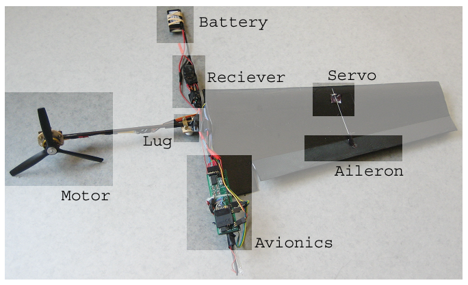

# What is a Monocopter?

A monocopter is a helicopter with one wing.
One one side of the monocopter is the wing
and on the other is the motor.

A monocopter flies like a falling maple seed.

# Why are Monocopters Important?

## 1) Monocopters are Mechanically Simple

A monocopter only need two inputs for control:

1. A way to control the wing's pitch,
2. And a way to control the motor's speed.

Compare this to an airplane, which needs four inputs for control:

1. Engine speed for thrust control.
2. Ailerons for roll control.
3. Elevators for pitch control.
4. Rudder for yaw control.

