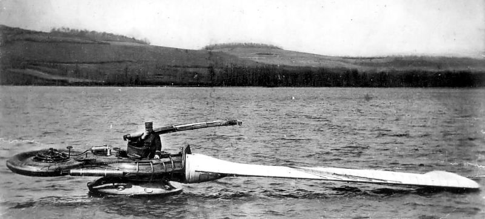
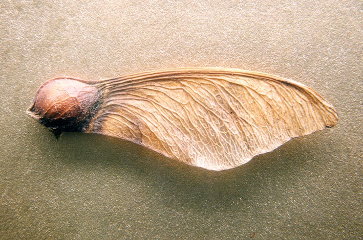
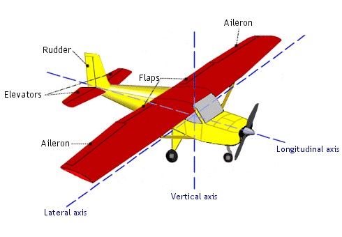
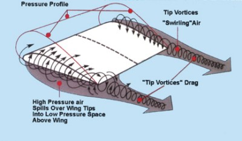
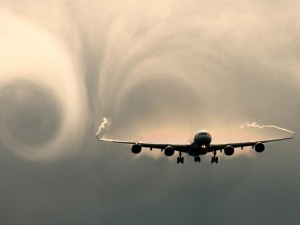

# What is a Monocopter?

**A monocopter is a helicopter with one wing.
One one side of the monocopter is the wing
and on the other is the motor.**

**A monocopter flies like a falling maple seed.**

# Why are Monocopters Interesting?

## 1) Monocopters are Mechanically Simple

**A monocopter only need two inputs for control:**

1. **A way to control the wing's pitch for lift.**
2. **A way to control the motor's speed for thrust.**

**Compare this to an airplane, which needs four inputs for control:**

1. **Engine speed for thrust.**
2. **Ailerons for roll.**
3. **Elevators for pitch.**
4. **Rudder for yaw.**

## 2) Monocopters Might be More Efficient

**Every wing creates a vortex, which is inefficient.
A monocopter only has one wing, so it only creates one vortex.**

