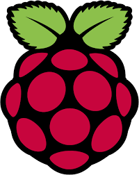
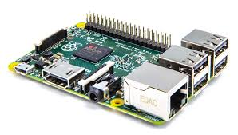

# Future Work

- **Continue building models to figure out what works.**
- **Design landing gear for safe takeoffs and landings.**
    - **So we don't break a propeller on every flight.**

# Raspberry Pi Control System

**A Raspberry Pi is a small single board computer
that has a processor, USB ports,
an HDMI port, and some general purpose inputs
and outputs, also called GPIO.
Eventually we would like to use a Raspberry Pi
to control the servo that moves the wing.
With additional sensors, like gyroscopes,
and autopilot software, we may be able
to control the flight direction of the monocopter.**

**In this demonstration we have a Raspberry Pi
controlling the wing servo using GPIO
and a small Python program.**

